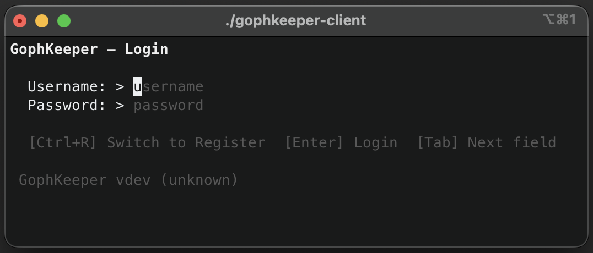
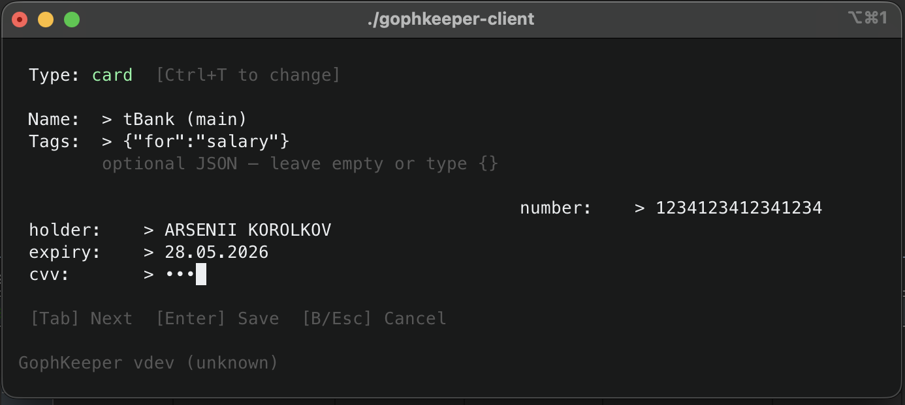
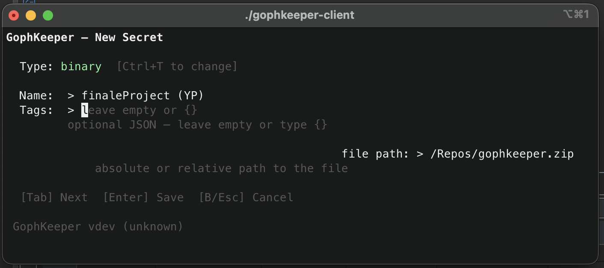
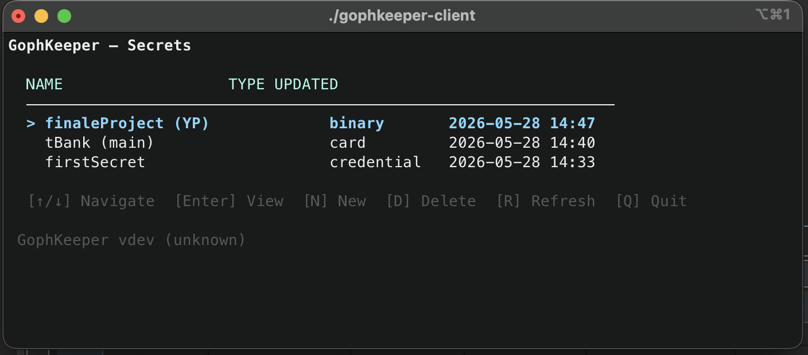
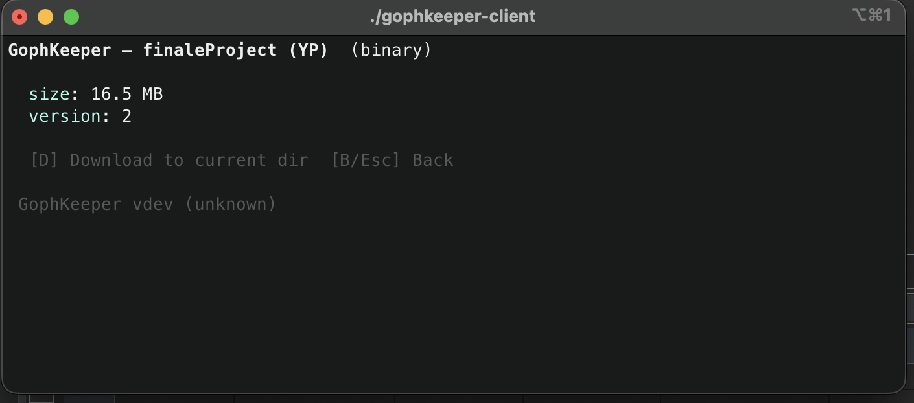

# GophKeeper

Клиент-серверный менеджер секретов для хранения логинов и паролей, текстовых заметок, данных банковских карт и бинарных файлов. Основной интерфейс — терминальный TUI-клиент.

**Техническое задание:** [Task.md](Task.md)

---

## Клиент











---

## Архитектура системы

```text
┌─────────────┐   gRPC API (+ JWT)      ┌────────────────────────────┐
│  TUI Client │ ──────────────────────► │        gRPC Server         │
│ (Bubble Tea)│                         │ PostgreSQL + MinIO Storage │
└─────────────┘                         └────────────────────────────┘
```

| Компонент | Назначение |
|------------|------------|
| **gRPC** | Основной транспорт; unary-запросы и streaming для файлов |
| **PostgreSQL** | Пользователи, метаданные секретов и зашифрованные данные |
| **MinIO** | Хранение бинарных файлов |
| **JWT** | Аутентификация запросов |
| **AES-256-GCM** | Шифрование данных |
| **version** | Оптимистическая блокировка для разрешения конфликтов |

---

## Security

- Пароли пользователей никогда не хранятся в открытом виде
- Данные шифруются с помощью AES-256-GCM
- Аутентификация выполняется через JWT
- Бинарные файлы хранятся отдельно в MinIO

---

## Реализованные возможности

- Регистрация и вход по логину и паролю
- CRUD-операции с секретами через TUI
- Список секретов без загрузки содержимого (только метаданные)
- Загрузка данных только по запросу (просмотр секрета / скачивание файла)
- Типы секретов: `credential`, `text`, `card`, `binary`
- Для бинарных файлов используется gRPC streaming
- Произвольные JSON-теги (`metadata`)
- Разрешение конфликтов версий при одновременном изменении
- Docker Compose для локального запуска сервера (PostgreSQL + MinIO)
- Версия и дата сборки клиента через `-ldflags`

---

## Быстрый старт (сервер)

Требования:

- Docker
- Docker Compose

```bash
git clone https://github.com/arsykor/gophkeeper
cd gophkeeper
docker compose up -d
```

Сервер запускается на порту:

```text
:50051
```

Перед использованием в production обязательно замените секреты в `docker-compose.yml`:

```yaml
JWT_SECRET: "change-me-jwt-secret"
ENCRYPTION_KEY: "a 64-character hex string (32 bytes)"
```

## Быстрый старт (клиент)

```bash
go build -o gophkeeper-client ./cmd/client/

# с версией и датой сборки
go build \
  -ldflags "-X main.Version=1.0.0 -X main.BuildDate=$(date -u +%Y-%m-%d)" \
  -o gophkeeper-client \
  ./cmd/client/

./gophkeeper-client
```

Кросс-компиляция:

```bash
GOOS=linux   GOARCH=amd64 go build -o gophkeeper-client-linux  ./cmd/client
GOOS=windows GOARCH=amd64 go build -o gophkeeper-client.exe   ./cmd/client
GOOS=darwin  GOARCH=arm64 go build -o gophkeeper-client-mac    ./cmd/client
```
